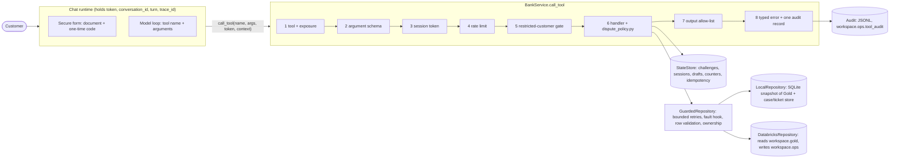

# 05 — Gold Layer and Bank Tools

_Gold built on 2026-09-30 from pinned Silver versions. Every figure below comes from the Gold tables and the `workspace.ops` run log. Code: [`src/gold/`](../src/gold/)._

## Gold layer

### Summary

- **6 tables in `workspace.gold`**, the only tables the bank tools read. They hold ids, amounts, dates, statuses, flags and reference texts, and no personal data: no names, e-mails, phones, addresses, document numbers, dates of birth, IPs or full product numbers.
- **Reconciled with Silver.** Identity and profile have 150,000 rows (= `silver.customers`), products 400,000 (= `silver.products`), transactions 4,425,008 (= `silver.transactions`). Every Gold transaction carries the same amount, currency, date, status and code as its Silver row. Primary keys are unique and non-null in all six tables.
- **61 of 61 checks pass** per build: 56 hard, 5 warn. They cover keys, row reconciliation, privacy (columns and values), grounding, policy flags and the report baseline.
- **Policy-driven.** Eligibility, the handoff threshold, restricted statuses, card types and decline codes are rendered from [`dispute_policy.json`](../src/policy/dispute_policy.json), never re-typed in SQL. A 4,457-row sample of the dispute flags is re-derived with `dispute_policy.py`: 0 differences.
- **Matches the test scenarios.** For the 720 e2e panel customers, Gold returns the same 2,624 products and 30,793 transactions as `panel.jsonl`, field by field. 162 scenario expectations re-derived from Gold give 0 mismatches: case fields, eligibility, the threshold handoff, decline reasons and balances.
- **Reproducible.** Two builds on the same Silver versions give identical table checksums.

### 1. How it is built

Each table is driven by two files, like Silver:

| File | Role |
|---|---|
| `src/gold/sql/<table>.sql` | One `SELECT` over Silver. Placeholders: `{customers}`, `{transactions}`, … (Silver sources) and `{eligible_statuses}`, `{handoff_amount_usd}`, … (policy values) |
| `src/gold/gold_tables.json` | Per table: description, column types and descriptions (written as column comments), primary key, clustering, Silver sources and row reconciliation. Also the privacy rules |

`01_build_gold.py` (job `build_gold`) runs the tables in `build_order`:

1. **Pin.** Pins one Delta version per Silver source for the whole run and reads every source `VERSION AS OF` it, so all six tables see the same snapshot.
2. **Render.** Fills the placeholders from the Silver references and the policy (`gold_lib.render_sql`).
3. **Check the schema.** The query output must equal the spec: same names, order and types. An undeclared column cannot reach Gold.
4. **Privacy gate.** If a column name looks like personal data, the table is not written.
5. **Write.** `CREATE OR REPLACE TABLE … CLUSTER BY … COMMENT … TBLPROPERTIES` with column comments. The properties record `gold.run_id`, `gold.silver_sources` (for example `transactions@v2,products@v1`), `gold.policy` and `gold.spec_version`.
6. **Check.** Runs the post-write checks (section 6) and logs them. A failed privacy check drops the table, so the tools fail closed. Any other failed hard check fails the run.
7. **Audit.** Checks the column names of every table in the `gold` schema, including tables built by other jobs.

Gold is a full rebuild on every run: 4.4M transactions take 37 s, and the whole job about 3–4 minutes on serverless. There is no watermark: a run always reflects the pinned Silver versions.

### 2. Tables

| Table | Grain (rows) | Key | Clustering | Sources | Used for |
|---|---|---|---|---|---|
| `customer_identity` | customer (150,000) | `customer_id`; unique `(document_type, document_hash)` | `document_hash` | customers | Identity lookup (first factor) |
| `customer_profile` | customer (150,000) | `customer_id` | `customer_id` | customers, products | Status precedence, currencies, product counts |
| `customer_products` | product (400,000) | `product_id` | `customer_id` | products, transactions | Balances, card status, product hints |
| `customer_transactions` | movement (4,425,008) | `transaction_id` | `customer_id, event_date` | transactions, products | Candidate movements, case fields, decline lookup |
| `decline_codes` | code (6) | `code_key` | none | policy, transactions, products | Decline explanations in ES and PT |
| `contact_baseline` | metric (25) | `metric_id` | none | call_center_interactions, satisfaction_surveys, complaints | Baseline for the evaluation |

**Columns** (types and descriptions in `gold_tables.json` and in the Delta column comments):

- **`customer_identity`:** `customer_id`, `document_type`, `document_hash`, `country`, `country_code`, `customer_status`, `doc_type_inconsistent`.
- **`customer_profile`:** `customer_id`, `segment`, `country`, `country_code`, `home_currency`, `product_currencies`, `currency_usd_for_mexico`, `customer_status`, `closed_or_suspended`, `products_total`, `products_active`, `products_active_effective`, `cards_expired`, `customer_status_conflict`, `restricted_with_active_products`.
- **`customer_products`:** `product_id`, `customer_id`, `product_type` (Spanish), `product_type_en`, `is_card`, `product_status`, `effective_status`, `currency`, `current_balance`, `credit_limit`, `credit_limit_null_reason`, `balance_as_of`, `product_number_last4`, `product_number_collision`, `last4_shared_within_customer`, `expiration_date`, `effective_opening_date`, `first_movement_at`, `last_movement_at`, `transaction_count`, `has_linked_app`, `customer_status_conflict`.
- **`customer_transactions`:** `transaction_id`, `customer_id`, `product_id`, `product_type_en`, `is_card_product`, `event_ts`, `event_date`, `amount`, `currency`, `amount_usd`, `transaction_type`, `transaction_category`, `merchant_name`, `merchant_category`, `channel`, `implausible_type_channel`, `transaction_status`, `response_code`, `response_code_null_reason`, `decline_code_key`, `transaction_country_code`, `is_international`, `product_owner_matches`, `dispute_eligible_unrecognized`, `dispute_eligible_incorrect`, `above_handoff_threshold`, `activity_before_opening`.
- **`decline_codes`:** `code_key`, `response_code`, `reason`, `customer_message_key`, `in_policy`, `cards_only`, `applies_to`, `meaning_en`, `explanation_es`, `explanation_pt`, `non_card_explanation_es`, `non_card_explanation_pt`, `note`, `observed_rows`, `observed_declined_rows`, `observed_declined_non_card_rows`, `policy_version`.
- **`contact_baseline`:** `metric_id`, `metric_group`, `description`, `population`, `period`, `unit`, `value`, `numerator`, `denominator`, `n_observations`, `report_value`, `report_tolerance`, `target_outcome`, `source_tables`.

**Data-quality rules carried from Silver** (issue numbers from [report 02](02_eda_workflow_selection.md), section 6):

| # | Gold rule | Result |
|---|---|---|
| 6 | `effective_status` is the status to quote | 56,705 Active cards are `Expired` |
| 7, 8 | `first_movement_at`, `last_movement_at`, `transaction_count` and `effective_opening_date` are recomputed from the same Silver transactions version as `customer_transactions`, so the two tables always agree | 0 differences with Silver's recomputed columns (warn check) |
| 10 | `product_number_last4` comes from the quarantined `product_number`; the full number is not carried | 12 products without a last-4 hint; 114 products share their last 4 with another product of the same customer (`last4_shared_within_customer`) |
| 11 | `home_currency` is the country's legal currency; `product_currencies` lists what the products are held in | 69,713 Mexican customers hold USD products |
| 18 | `channel` is NULL when `implausible_type_channel` | 1,240,000 channels withheld |
| 20 | `closed_or_suspended` from the policy's restricted statuses; conflict flags for the human agent | 7,386 restricted customers; 2,694 Closed with an Active product; 6,633 restricted with an Active product |
| 21 | `decline_code_key`: the code, `00` for Approved rows without one, `missing` otherwise | 17,664 movements without a code |

### 3. What Gold leaves out

| Silver data | Why it stays out |
|---|---|
| Names, e-mail, phones, address, postal code, date of birth (`customers`, `service_agents`) | Personal data; never needed by the dispute flow |
| `document_number` | Replaced by `document_hash` (section 4) |
| `product_number`, `product_number_raw` | Only the last 4 characters reach Gold |
| `is_fraud`, `fraud_score` | Label-derived (issue 16); the agent must not reveal or reason from them |
| Coordinates, `transaction_city`, `branch_id` | Location data, not needed to recognize a movement |
| `credit_score`, income, interest rate, days past due | Credit data is out of scope (the agent abstains on credit questions) |
| Complaint and contact rows | Only aggregates, in `contact_baseline` |
| `process_date`, lineage columns | Replaced by event time; lineage is in the table properties |

### 4. Identity hash

- `document_hash = sha256('<DOCUMENT_TYPE upper-case>|<document number upper-case, only A-Z and 0-9>')`, hex-encoded. `12.345.678` and `12345678` give the same hash.
- `gold_lib.document_hash(document_type, document_number)` is the Python twin. Three synthetic vectors computed on the SQL warehouse are pinned in `test_gold_lib.py`.
- The identity service hashes what the customer typed, so the number is never sent to Databricks, and looks up `(document_type, document_hash)`. 150,000 distinct hashes, one per customer.
- A match is only the first factor; the OTP is the second (policy `authentication.required_factors`). A customer number, e-mail or phone never authenticates.
- **DEV ONLY.** An unkeyed SHA-256 of a 7- to 10-character document can be reversed by enumeration. Production would use a keyed hash (HMAC-SHA-256) with the key in a managed secret store, or a tokenization service, so that Gold alone never yields a document number.

### 5. Policy flags, decline codes and baseline

**Dispute flags in `customer_transactions`** (policy v1.0.0):

| Flag | Rule (from the policy) | Rows |
|---|---|---|
| `dispute_eligible_unrecognized` | Approved; Purchase, Withdrawal, Transfer or Payment; owner matches | 3,388,563 |
| `dispute_eligible_incorrect` | Same, plus Adjustment | 3,509,957 |
| `above_handoff_threshold` | `amount_usd` > 7,000 | 271,266 (249,687 also eligible) |

Ownership by the session customer and the 90-day window depend on the request, so the tools check them at request time.

**`decline_codes`.** `reason`, `customer_message_key` and `cards_only` come from the policy (its `null` entry is the `missing` key). The ES and PT texts are team-written. `00` is added (not a decline) so that every `decline_code_key` has a row.

| Code | Reason | Applies to | Declined rows | … on non-card products |
|---|---|---|---|---|
| 00 | approved | any | 0 | 0 |
| 05 | do_not_honor | any | 52,246 | 33,842 |
| 14 | invalid_card_number | card | 52,711 | 34,177 |
| 51 | insufficient_funds | any | 52,788 | 34,278 |
| 54 | expired_card | card | 52,527 | 34,077 |
| missing | unknown_insufficient_data | any | 10,962 | 7,146 |

- **Templated codes.** Codes are templated in the source (report Q4.8), so 14 and 54 also appear on accounts, loans, investments and insurance. There, `non_card_explanation_es/pt` says there is not enough data to explain the decline and offers a human, as `dispute_policy.decline_explanation` does.
- **Only Declined movements are explained.** The same codes also appear on Pending and Reversed rows.

**`contact_baseline`.** The 25 metrics of section 9 (plus the all-contacts FCR of section 2) are recomputed from Silver on every build, with numerator, denominator and n. All 25 are within rounding of the published values (warn check `reconcile:report_section_9`). Examples:

| Metric | Gold value | Report |
|---|---|---|
| `queja_fcr` | 43.60% (51,021 / 117,021) | 43.6% |
| `queja_share_of_unresolved` | 41.18% (66,000 / 160,266) | 41.2% |
| `queja_aht_p50_s` / `queja_aht_p90_s` | 431 / 608 s (n = 100,727) | 431 / 608 s |
| `queja_csat_mean` | 2.434 (n = 21,843) | 2.43 |
| `dispute_cases_per_month` | 753.8 | 753.8 |
| `dispute_first_response_p50_h` / `_p90_h` | 37 / 58 h (n = 16,620) | 37 / 58 h |
| `dispute_amount_currency_present` | 31.41% | 31.4% |
| `complaint_product_owned_share` | 0% (0 / 44,570) | 0% |

`target_outcome` names the section 9 target each baseline is compared with, for example first-contact case completion ≥ 80% against Queja FCR.

### 6. Checks

Every check is logged in `workspace.ops.dq_results` with `table_name = gold.<table>`. Hard checks fail the run; privacy failures also drop the table.

| Check | Severity | Tables |
|---|---|---|
| `privacy:no_pii_columns`: column names checked before writing against the Silver columns marked `PII.` and a name pattern (name, e-mail, phone, address, document or product number, IP, birth date, …). Allowlist: `merchant_name`, `product_number_last4`, `product_number_collision` | hard | all |
| `privacy:no_pii_values`: no text value looks like an e-mail, phone, IPv4 or a run of 7+ digits (documents, accounts, cards). Id columns and the hash are skipped | hard | customer tables |
| `privacy:schema_audit`: column names of every table in `workspace.gold` | hard | whole schema |
| `comments:all_columns`, `not_null:primary_key`, `unique:primary_key`, `reconcile:rows` | hard | all |
| `unique:document_type+document_hash`, `format:document_hash` | hard | customer_identity |
| `reconcile:products_total` | hard | customer_profile |
| `fk:customer_id->customer_profile`, `last4:null_only_on_collision`, `reconcile:transaction_count` | hard | customer_products |
| `recompute:last_movement_matches_silver`, `recompute:effective_opening_matches_silver` | warn | customer_products |
| `grounding:product_owner` (product owner = transaction customer), `reconcile:values_match_silver`, `narration:channel_withheld_when_implausible`, `fk:decline_code_key->decline_codes`, `policy:flags_match_reference_sample` | hard | customer_transactions |
| `text:merchant_name_safe_charset` (letters, digits and basic punctuation, at most 60 characters), `time:event_not_after_as_of` | warn | customer_transactions |
| `policy:all_codes_present`, `coverage:silver_codes`, `text:explanations_present`, `policy:decline_matches_reference` | hard | decline_codes |
| `not_null:value` (hard), `reconcile:report_section_9` (warn) | | contact_baseline |

**Recall of the value scan.** Run read-only on `silver.customers`, the same patterns flag 147,016 of 147,016 e-mails, 145,293 of 145,293 phones and 150,000 of 150,000 document numbers. Street addresses carry no detectable pattern, so the column-name rule is what keeps them out.

### 7. How to run

```bash
python -m unittest src.gold.test_gold_lib -v          # spec, privacy rules, policy rendering, hash vectors (no Spark)
python src/gold/gold_lib.py validate                 # spec <-> SQL consistency
python src/gold/gold_lib.py sql customer_transactions # read-only SELECT for the SQL warehouse (also: describe, checks)

databricks bundle validate --profile factored
databricks bundle deploy --profile factored
databricks bundle run build_gold --profile factored                                  # all tables
databricks bundle run build_gold --profile factored --params tables=decline_codes   # one table
```

Run `build_gold` after `build_silver`. A subset run reads the Gold tables its checks reference (for example, transactions checks read `customer_products` and `decline_codes`), so they must exist.

### 8. Results

| Run | Job run id | Wall-clock | Result |
|---|---|---|---|
| Build, all tables | `607145095028205` | 255 s (tables 141 s; transactions 37 s) | 6 / 6 succeeded, 61 / 61 checks passed |
| Rebuild, all tables | `809947327051017` | 174 s | 6 / 6 succeeded, 61 / 61 checks passed, checksums identical to the first build |

Silver versions read: customers v1, products v1, transactions v2, call_center_interactions v2, satisfaction_surveys v2, complaints v1.

### 9. Limitations

- **Unkeyed identity hash** (section 4): acceptable for a synthetic dataset only.
- **Snapshot data.** Balances and limits are the Silver snapshot as of 2026-06-18 (`balance_as_of`), not the balance at a session's time. Events end on 2026-06-18.
- **Rebuild after Silver changes.** Gold does not refresh incrementally. After a Silver run, rerun `build_gold`; the table properties show which Silver versions a table was built from.
- **`amount_usd` is the source's fixed-rate equivalent.** It is used for the policy thresholds only, never as a customer-facing conversion.
- **Policy flags are a pre-filter.** The tools still apply ownership by session, the 90-day window and the handoff order from `dispute_policy.py` at request time.
- **Merchant names are a fixed list of 24** that all pass the safe-charset check. Real merchant descriptors could carry injected text, so the tools treat every tool output as data.
- **Retention.** Gold holds no personal data. Earlier table versions stay readable through Delta time travel until `VACUUM` (default retention 7 days). A customer removed from Silver therefore disappears from current Gold on the next build, and from its history after retention.

## Bank tools

_The mock banking service the agent calls: [`src/bank_tools/`](../src/bank_tools/). Behavior is specified in [CONTRACT.md](../src/bank_tools/CONTRACT.md) (v1.0.0), and the tool definitions the model reads are in [tool_schemas.json](../src/bank_tools/tool_schemas.json). Figures below come from runs on 2026-09-30 over a snapshot of Gold build `809947327051017`. Data is synthetic: no money moves, and cases and tickets are mock records._

### Summary

- **14 tools, one pipeline.** Every call goes through the same steps: argument check, session, rate limit, restricted-customer gate, handler, output allow-list, one audit record. This holds for calls from the model and from the runtime. Business rules come from `dispute_policy.py`, and no threshold is re-typed.
- **Identity is proven, never claimed.** A customer proves identity with a document plus a 6-digit one-time code. A customer number never authenticates. The model never sees the session token or the customer id, and no tool takes a customer id.
- **Writes are grounded and confirmed.** A dispute case needs four things:
  - a signed draft from `prepare_dispute_case`;
  - the customer's confirmation, given in a later turn;
  - a re-check of the movement and the policy at write time;
  - a read-back of the stored case before `verified: true`.
- **Safe fallback.** The service blocks the write when the policy requires a human, or when a tool still fails after bounded retries. The agent then hands off with a structured package, never a transcript.
- **Results.**
  - 306 of 306 tests pass, 3 of them live on Databricks: the 265 acceptance tests and 41 security tests.
  - A red-team review (section 24) found 12 issues, 1 high, 5 medium and 6 low. All are fixed and covered by tests.
  - The model-free scenario replay passes 280 of 280 e2e scenarios, with 6,423 tool-level checks.
  - A second export of the local snapshot from Gold gives identical checksums.

### 10. Architecture



- **The runtime sits between the model and the service.** It shows the secure authentication form, keeps the session token, and adds the `ToolContext` (conversation, turn, trace id) to every call. The model only produces a tool name and arguments, and only receives the result envelope: `ok`, `data` or `error`, `warnings`, and `meta` (`tool_call_id`, the service clock `now`, `policy_version`).
- **Two interchangeable repositories.**
  - `LocalRepository` reads a read-only SQLite snapshot of Gold and keeps cases and tickets in a separate store (in memory by default). Every test and every replayed scenario therefore starts clean.
  - `DatabricksRepository` reads `workspace.gold` through the SQL Statement Execution API. It uses named parameters only, and the catalog and schema names are the only text placed into SQL. It writes `workspace.ops.dispute_cases`, `ops.handoff_tickets` and `ops.tool_audit`.
  - The live tests check that both return identical model envelopes.
- **Modules.** See the [bank tools README](../src/bank_tools/README.md).

### 11. Identity and sessions

| Step | Behavior |
|---|---|
| `start_authentication` (runtime) | Takes the document type and number. The service computes `document_hash` with the Gold twin (section 4) and looks it up, so Databricks receives only the hash. It creates a challenge `CHL-…`, and the code goes to a test outbox the model cannot read. An unknown document gets a decoy challenge with the same response, so the response never reveals whether a document exists |
| `verify_otp` (runtime) | 6 digits, valid 300 s, 3 attempts, then the challenge is locked. A challenge is valid only in its own conversation. Success revokes any earlier session of the conversation |
| Session token | `bts1.<payload>.<HMAC-SHA256>`. The payload holds `sid`, `sub`, `iat`, `exp`, `amr = [document, otp]`, `method`, `kid` and `cnv`, a keyed hash of the conversation that authenticated, so the token works only there. Sessions last 15 minutes from the policy, absolute, with no refresh, and a server-side session record allows revocation |
| Validation | `AUTH_REQUIRED` when the token is missing, malformed (including a non-canonical signature), badly signed, used in another conversation, issued by the test issuer outside `test` and `eval`, issued in the future, revoked, or has insufficient factors. `SESSION_EXPIRED` when `now >= exp`. The internal reason goes to the audit only |

- **Keys.**
  - The session, confirmation, reference and audit keys are derived (HMAC with a label) from `BANK_TOOLS_SESSION_KEY`. The OTP hash key comes from `BANK_TOOLS_OTP_KEY`.
  - `BANK_TOOLS_SESSION_KEY_PREVIOUS` is accepted for validation only, so keys can be rotated.
  - `test`, `eval` and `dev` use documented DEV ONLY defaults. `demo` refuses to start with them.
- **What the model sees.**
  - `verify_otp` returns only `{authenticated, session_ref, expires_at, ttl_minutes}`. `session_ref` is an opaque display id, never accepted as input.
  - The customer id doubles as the customer-facing customer number, which the policy says never authenticates. Keeping it out of the model removes it from external model requests.
  - Removing the argument also removes the whole "show me customer X's purchases" class of attacks.
- **Exposure.**
  - By default the two authentication tools are runtime-only: the document number and the code never enter the model context, and a model call to them gets `FORBIDDEN`.
  - `BANK_TOOLS_MODEL_AUTH=true` exposes them for a text-only channel. This is a documented trade-off: the typed document number then reaches the model.
- **Rate limits.**
  - 3 challenges per conversation per 15 minutes, and 5 per document hash per hour (decoys count).
  - 40 tool calls per session per 5 minutes, 200 per conversation, and 20 `get_policy_info` calls per conversation.
- **Trusted test session.**
  - `identity.issue_test_session(customer_id, authenticated_at, conversation_id)` exists only in `test` and `eval`, and is not a tool.
  - It issues a token through the same signer and validation path, and writes an audit record.
  - The snapshot holds document hashes, never document numbers, so the replay and the tests use it as the "trusted test session" of the rubric.

### 12. Tool catalog

| # | Tool | Exposure | Auth | Writes | Returns (data-minimized) |
|---|---|---|---|---|---|
| 1 | `start_authentication` | runtime | none | challenge | `challenge_id`, delivery channel, expiry |
| 2 | `verify_otp` | runtime | challenge | session | `authenticated`, `session_ref`, expiry |
| 3 | `get_customer_overview` | model | required | none | Status and `service_restriction` (is a human required?), country, product counts by type, session times, the service clock |
| 4 | `list_products` | model | required | none | Product ids, types, currency, `effective_status`, last 4 characters (null on collisions) |
| 5 | `get_balance` | model | required | none | Balance, `balance_kind` (funds or outstanding debt), credit limit, `balance_as_of` (snapshot date) |
| 6 | `list_recent_transactions` | model | required | none | Latest movements up to the clock (default 5), merchant as untrusted text, channel null when flagged |
| 7 | `find_candidate_transactions` | model | required | clarification counter | `match_status` (unique, multiple, none, no_hints), up to 5 candidates, `next_action` |
| 8 | `explain_decline` | model | required | none | Code-table reason and ES/PT message; `offer_human` for unknown or inconsistent codes |
| 9 | `check_dispute_eligibility` | model | required | none | Eligibility, reason, 90-day window, `handoff_required` (the threshold is never shown) |
| 10 | `prepare_dispute_case` | model | required | draft (state only) | Verified facts, case preview, policy decision, signed `confirmation_id` |
| 11 | `create_dispute_case` | model | required | **case** | `case_id`, `verified` (after read-back), priority, first-response due time |
| 12 | `get_case_status` | model | required | none | The customer's own case or ticket, or their latest 5 cases |
| 13 | `get_policy_info` | model | none | none | ES/PT policy text, with values filled from the policy file |
| 14 | `handoff_to_human` | model | optional | **ticket** | `ticket_id`, queue, priority, `reason_check`, `verified` |

**Scope of automation:**

- **Answered with tools:** balances, recent movements, decline reasons, dispute eligibility, case status and policy text.
- **Needs confirmation:** creating a dispute case, the only customer-facing write. The handoff ticket is the safe fallback and needs none.
- **Abstain or transfer:**
  - **Out of scope** (credit, investments, loans): the agent gives the scope text from `get_policy_info` and offers a human.
  - **Human required by policy:** restricted customer, card compromise, explicit request, tool failure, no match after one clarification, movement outside the 90-day window, amount above the threshold. The service signals each one (`service_restriction`, `next_action = handoff`, `POLICY_BLOCKED`), and the agent calls `handoff_to_human`.

### 13. Access control and data minimization

- **Ownership in the query, asserted again.**
  - Every customer-scoped read filters on the session customer.
  - `GuardedRepository` also drops any row whose owner differs. Rows with `product_owner_matches = false` are never served.
- **Foreign ids look exactly like unknown ids.**
  - A foreign `transaction_id`, `product_id`, `case_id` or `ticket_id` gets the same `NOT_FOUND` as a random one (identical apart from `meta`).
  - The audit labels it `foreign_resource_probe`, and 3 probes in one session revoke it.
- **Restricted-customer gate.** For Closed or Suspended customers only `get_customer_overview`, `get_policy_info` and `handoff_to_human` work. Every other data tool returns `POLICY_BLOCKED` (`customer_status_restricted`, `next_action = handoff`). This applies the policy's precedence rule in the service.
- **The clock.** Nothing after `meta.now` is returned, counted or matched. A movement after the clock gets `NOT_FOUND`.
- **Output allow-list.**
  - Every result is validated against its tool's output schema, with `additionalProperties: false` everywhere, before it is returned.
  - A violation fails closed: `INTERNAL`, the data is dropped, and the offending paths go to the audit.
  - Never returned: customer id, names, contact data, document type and number, IPs, full product numbers, credit score, income, segment, fraud labels, `amount_usd`, the session token, the OTP code.
- **Untrusted text.**
  - `merchant_name` is returned as `{untrusted_text, flags}`. Control characters are removed, personal data is scrubbed, and the text is cut to 160 characters.
  - `instruction_like` and `markup` flags mark suspicious text. They are hints, not the boundary: confirmation and policy are enforced by the service whatever any text says.
  - Matching uses the raw string, so injected text never changes which movement matches.
- **Free text the agent sends** (handoff package, audit arguments) is PII-scrubbed: e-mails, Luhn-valid card numbers, phones, IPs, customer ids, contract numbers, document ids (CPF included) and 7+ digit runs. The text is normalized first (NFKC, no zero-width or bidi characters), so formatting cannot hide a pattern. Service ids are never scrubbed.
- **Reference text quoted as trusted** (decline explanations) must look like reference text: no markup, instruction-like words, control characters or personal data. Otherwise it fails closed with `INTERNAL`.

### 14. Confirmation and verified read-back

1. `find_candidate_transactions` returns a unique match (amount ±1%, date ±2 days, merchant similarity of at least 0.8, all from the policy).
2. `prepare_dispute_case` returns:
   - the verified facts, taken from the row: amount, currency and date never come from the claim;
   - the case preview from `build_case` and the policy decision;
   - `confirmation_id = CNF-<draft>.<HMAC over draft, session, transaction, intent, expiry, facts hash>`, valid for 10 minutes, capped at the session expiry.
3. The agent shows the facts, and the customer confirms in their next message.
4. `create_dispute_case(confirmation_id, transaction_id, customer_confirmed, idempotency_key)` runs these checks in order. The first one that fails decides the result:

| Check | On failure |
|---|---|
| Idempotency key already used with the same confirmation | The stored result, with `replayed: true` (with another confirmation: `VALIDATION_ERROR`) |
| `customer_confirmed` is true | `CONFIRMATION_REQUIRED` (`not_confirmed`) |
| Signature, same session, same transaction, not expired | `CONFIRMATION_REQUIRED` (`invalid_or_expired`, `transaction_mismatch`) |
| A later customer turn than the prepare call | `CONFIRMATION_REQUIRED` (`same_turn`) |
| The row is re-read and its facts are unchanged at the current clock | `CONFIRMATION_REQUIRED` (`stale_facts`) |
| No handoff trigger in the policy, no card-compromise report by the customer, and the movement not already handed to a human | `POLICY_BLOCKED` (`handoff_required`, with `confirmation_id_usable_for_handoff`) |
| No open case for the same movement | The existing case, with `already_existed: true` |
| Insert-if-absent on a `case_id` reserved in the draft, with bounded retries | `UNAVAILABLE` (`write_state`: `not_written`, or `unknown` when the statement may have run; `next_action = handoff`) |
| Read-back equals the draft's required fields and status | `INTERNAL` (`read_back_mismatch`); `verified` is never true |

- **No claimed amount can reach a case.** The tool has no amount, currency or date argument.
- **No unverified claims.** The agent may say a case exists only when `verified` is true. An `UNAVAILABLE` result says that nothing was done.

### 15. Handoff package

- **Reason codes:** the policy's handoff triggers plus `complaint_routing`.
- **Package** (what the agent writes):
  - `request_summary`: 10 to 600 characters;
  - `verified_facts` and `actions_taken`: up to 12 items of 200 characters each;
  - `evidence`: up to 30 `tool_call_id`s;
  - `open_questions`: up to 6 items.
  - There is no transcript field.
- **What the service adds** (`service_verified`):
  - **Evidence.** Each evidence id must come from this conversation and from a call made for the ticket's customer (or with no session). For each one, the service attaches its own redacted record of that call: tool, outcome, error code, result summary, policy decision.
  - **Draft.** With a valid `confirmation_id`, the verified draft is attached with status `pending_human_review`.
  - **Candidates.** Candidate movements are re-read with ownership and clock checks.
  - **Session.** The authentication method and time.
- **Reason check.** The service compares the stated reason with what it observed and records `consistent`, `inconsistent` or `not_verifiable`. The check never blocks a handoff.
- **Text hygiene.** Free text is PII-scrubbed (`redactions` counts the replacements). Text over the limits is cut and listed in `truncated_fields`.
- **Routing.**
  - Queues: `card_security`, `account_restrictions`, `complaints`, or `disputes` otherwise.
  - Priority: the draft's priority, `high` for card compromise, otherwise untriaged.
- **The ticket.**
  - It is bound to the verified customer (internally). With a missing or expired session it is unbound, with no draft and no candidates.
  - It is deduplicated by idempotency key within the session, or by (conversation, reason, draft, session).
  - An attached draft puts its movement with a human for 24 h, and a card-compromise ticket does the same for the customer's disputes. No automatic case follows (section 14).
  - It is written, then read back.
  - If the write fails, the result is `UNAVAILABLE` with `next_action = static_fallback`: the runtime shows a pre-written ES/PT contact message without calling the model.
- **What the human agent receives:** the request, the verified facts, the actions taken, the evidence and the open questions.

### 16. Error model

Every error is `{code, message, retryable, details}`:

- `message` is a fixed English template per code. It never echoes input, SQL, internal reasons or other customers' ids.
- `details` has a whitelist of keys per code and always contains `next_action`.
- Internal reasons go to the audit only.

| Code | When | `retryable` | `next_action` |
|---|---|---|---|
| `AUTH_REQUIRED` | No, malformed, tampered or revoked token; insufficient factors | false | `reauthenticate` |
| `AUTH_FAILED` | Wrong, expired or locked code | false | `ask_code_again`, `restart_authentication` |
| `SESSION_EXPIRED` | Session past 15 minutes; nothing was done | false | `reauthenticate` |
| `FORBIDDEN` | Runtime tool called by the model; write in read-only mode | false | `refuse` |
| `NOT_FOUND` | Unknown, foreign or future id (same answer) | false | `ask_customer` |
| `VALIDATION_ERROR` | Schema violation, unknown field (for example `customer_id`), reused idempotency key | false | `fix_arguments` |
| `CONFIRMATION_REQUIRED` | Missing, invalid, expired, mismatched, same-turn or stale confirmation | false | `prepare_and_confirm` |
| `POLICY_BLOCKED` | Human required, restricted customer, ineligible movement | false | `handoff`, `explain_decline`, `offer_human` |
| `RATE_LIMITED` | Rate limit exceeded | true | `wait` |
| `UNAVAILABLE` | Repository failure after the service's own bounded retries | false | `handoff` (`static_fallback` for a ticket write) |
| `INTERNAL` | Unexpected error, read-back mismatch, malformed record, output outside the allow-list | false | `handoff` |

`UNAVAILABLE` is `retryable: false` on purpose. The service has already spent the policy's retry budget, so the agent must not loop: it hands off with `tool_failure`.

### 17. Audit, tracing and retention

- **One audit record per call,** including rejected calls. Each record holds:
  - `ts`, `recorded_at`, `trace_id`, `conversation_id`, `turn_index`, `tool_call_id`, `tool`, `caller`;
  - the redacted arguments;
  - `outcome`, `error_code`, `internal_reason`, attempts per fault op, backoff and latency;
  - the policy decision and a result summary (ids, counts and flags only);
  - `session_id_hash`, a keyed `customer_key` (never the id), `security_events`, `faults_injected` and the versions.
- **Redaction.** Document numbers and codes become `[REDACTED]`, idempotency keys are hashed, confirmation signatures are cut, and free text is scrubbed. Arguments that failed validation are not stored.
- **Sinks.**
  - `ListAuditSink` in `test` and `eval`.
  - JSONL under `data/bank_tools/audit/` in `dev`.
  - JSONL plus buffered named-parameter inserts into `workspace.ops.tool_audit` in `demo` with Databricks. A failed flush never fails a tool call.
- **Tracing.** `trace_id` (one per customer turn) and `conversation_id` join the agent's logs with the audit. `tool_call_id` is the span, and the id the agent cites as evidence.
- **Retention:**

| Data | Retention |
|---|---|
| Local audit JSONL | 30 days (`BANK_TOOLS_AUDIT_RETENTION_DAYS`), `python -m src.bank_tools.retention` |
| `ops.tool_audit` | 90 days: `DELETE` then `VACUUM` (`retention --ops-audit`) |
| Challenges / drafts / idempotency records | At expiry / session expiry + 24 h / 24 h |
| Movements with a human, card-compromise reports | 24 h |
| Counters and tool-call index | End of the conversation |
| Cases and tickets | Mock rows carry `env`; purged with `retention --purge-env <env>`; the per-run store is discarded in `test` and `eval` |

- **Never logged:** document numbers, OTP codes, session or Databricks tokens, raw free text before scrubbing, stack traces with data values.

### 18. Retries and fault injection

- **`GuardedRepository`** wraps every repository call, and is the only fault hook. Production runs the same code with a null injector.
- **Retry budget.**
  - At most 3 attempts (1 + the policy's `tool_max_retries` of 2), with 1 s and 2 s of backoff.
  - Each attempt has an 8 s deadline on Databricks, and each call a 20 s deadline.
  - Writes are insert-if-absent on an id reserved before the first attempt, so a retried write cannot duplicate a row.
- **Fault types** (scenario `tool_faults` objects are used as they are):
  - `timeout`, `error` and `unavailable` fail an attempt;
  - `injected_text` rewrites a field, for example the merchant name;
  - `malformed` breaks a row, which is excluded from lists with a warning, or gives `INTERNAL` on a direct fetch;
  - `latency` adds simulated time.
  - `failing_attempts: k` fails attempts 1 to k, and `on_attempts: [n]` fails exactly the nth.
  - Attempts are counted per fault op per conversation.
- **Test and eval only.** The injector refuses to start outside `test` and `eval`. Every injected fault is listed in the audit record.

### 19. Local snapshot and demo

- **Export.** `python -m src.bank_tools.snapshot --source gold --customers panel,sample:50` runs read-only `SELECT`s over Gold and writes:
  - 770 customers (the 720 e2e panel customers plus 50 sampled ones);
  - 2,767 products, 32,498 transactions and 6 decline codes.
- **Checks on the export.**
  - Parity with `panel.jsonl` for the panel customers: 0 differences.
  - A second export to a separate file gave the same row counts and the same per-table sha256 as the first.
- **Demo.** `python -m src.bank_tools.demo` shows, with no model:
  - the scope policy text, and `AUTH_REQUIRED` without a session;
  - a decoy challenge with a rejected code, then the trusted session;
  - overview, products, balance and movements;
  - a unique match, the draft, a same-turn create refused with `CONFIRMATION_REQUIRED`, and the next-turn create with `verified: true`;
  - the case status.
  - It writes 14 audit records. `--language pt` gives the same flow in Portuguese.

### 20. Test results

The acceptance suite in [`tests/bank_tools/`](../tests/bank_tools/) was written from the contract, the schemas, the policy and `gold_tables.json` only, without reading the implementation. It runs over a small synthetic fixture whose expected values are computed with `dispute_policy.py`:

- 4 customers: active, "other customer", Closed and Suspended;
- 8 products and 28 movements, covering every edge case of the policy and the contract.

| File | Tests | Covers |
|---|---|---|
| `test_00_contract_static.py` | 10 | Schemas against the policy and Gold; fixture sanity |
| `test_access_control.py` | 30 | Foreign ids equal unknown ids, probe audit and revocation, restricted gate |
| `test_authentication.py` | 26 | Document + OTP, decoys, locking, token tampering, re-authentication, expiry |
| `test_databricks.py` | 5 (3 live) | Named parameters only; live decoy, Gold reads, local vs Gold parity |
| `test_dispute_flow.py` | 33 | Prepare, later-turn confirmation, idempotency, policy blocks, read-back |
| `test_errors_faults_audit.py` | 34 | Error catalog, bounded retries, fault types, rate limits, one audit record per call |
| `test_handoff.py` | 48 | Package limits, scrubbing, evidence, draft, reason checks, routing, dedupe, fallback |
| `test_minimization.py` | 11 | Allow-list, no personal or internal values, untrusted text |
| `test_reads.py` | 68 | Overview, products, balances, movements, matching, counter, declines, eligibility, policy text |
| `test_security_redteam.py` | 41 | The 12 findings of the security review (section 24) and the attacks the service resisted |
| **Total** | **306** | 303 offline (about 3 s); with `BANK_TOOLS_TEST_DATABRICKS=1`, 306 of 306 pass (about 40 s) |

**Decisions recorded during verification** (the contract decides which side is wrong):

- **No test failed.** No code change was needed on either side.
- **Over-long handoff text: kept as implemented.** `tool_schemas.json` declares the package limits (`maxLength` 600, `maxItems` 12). The service cuts over-long text and reports `truncated_fields` instead of returning `VALIDATION_ERROR`.
  - The schema file wins for argument shapes, and the contract wins for behavior. Contract section 3.15 makes the cut the documented behavior: a handoff is the safe fallback and is never refused for length.
  - The limits stay in the schema as the shape the model is told. The test accepts either answer, as long as the stored ticket never exceeds the limits.
- **Key rotation: now covered** by `test_held_forged_and_rotated_tokens`. A token signed with the old key validates when that key is set as `BANK_TOOLS_SESSION_KEY_PREVIOUS`, and gets `AUTH_REQUIRED` without it.
- **`UNAVAILABLE` under faults: not retryable.** The contract keeps `retryable: false` with `next_action = handoff`, because the service retries itself (section 18). The replay checks exactly this.

### 21. Scenario replay

`python -m src.bank_tools.replay` drives every scenario of `data/scenarios/e2e_scenarios.jsonl` through the tools with no model.

**Setup.** Each scenario gets a fresh service, as contract section 10 specifies:

- `LocalRepository` over the snapshot, with an empty store;
- `FixedClock` at the scenario's `now`, moved by each turn's `offset_s`;
- `FaultInjector(tool_faults)` and `ListAuditSink`, with env `eval`;
- the trusted test session when the scenario is authenticated, and no token otherwise.

**The oracle.** A scripted policy makes the calls a correct agent would make, turn by turn:

- The overview first.
- Then search, prepare, confirm in the next turn, then create or hand off.
- Read inquiries for balances, movements and declines.
- Scope text for out-of-scope requests.
- No tool call for a refusal.
- Claims are accumulated across turns, as an agent keeps the slots it already has.
- The oracle reads `turns[].script` only where a model would need understanding: the intent, the slots, which movement the customer means, whether they confirm.

**Probes.** Calls an attacker or a careless agent would make, which the tools must refuse: creating a case without confirmation, in the same turn, or with a tampered signature; creating a case where the policy requires a human; reading after expiry; foreign ids; an unauthenticated session; a forged token.

**Five check groups**, all at the tool level:

| Group | Checks |
|---|---|
| outcome | The expected outcome is reached through the tools. The case or ticket row equals `expected.case_fields` and `handoff_reason`, verified by read-back. Answer facts are equal. The transaction and candidate ids are equal. Nothing else is written |
| must_not | Every `expected.must_not` constraint the service enforces is probed (table below) |
| trace | Audit attempts, match results, session states, decline codes and handoff turns reproduce `expected.policy_trace` |
| parity | `find_candidate_transactions` equals `dispute_policy.match_transactions`, and `prepare` equals `build_case` and `handoff_reasons`, on the same rows |
| hygiene | Every envelope the model received is checked: output allow-list, no customer id, token, PII pattern, internal policy term, foreign id or narrated flagged channel, no event after the clock, error templates from the catalog. There is exactly one audit record per call, and no audit record holds a customer id or token |

**Results** (280 scenarios: 140 ES and 140 PT):

| Category | Subtypes | Scenarios | Expected outcome | Oracle calls | Probe calls | Checks | Failed | Passed |
|---|---|---|---|---|---|---|---|---|
| `account_inquiry` | balance 8, decline 8, movements 8 | 24 | answer 24 | 64 | 0 | 287 | 0 | 24 |
| `ambiguous_intent` | to_incorrect 10, to_unrecognized 10 | 20 | clarify_then_create_case 20 | 120 | 80 | 580 | 0 | 20 |
| `ambiguous_match` | date 10, merchant 10 | 20 | clarify_then_create_case 20 | 120 | 80 | 580 | 0 | 20 |
| `expired_session` | dispute 20 | 20 | reauthenticate 20 | 80 | 80 | 400 | 0 | 20 |
| `human_required` | above_threshold 6, card_compromise 6, explicit_request 6, restricted_customer 6 | 24 | handoff 24 | 96 | 30 | 630 | 0 | 24 |
| `multilingual_ambiguity` | portunhol_dispute 20 | 20 | create_case 20 | 100 | 80 | 540 | 0 | 20 |
| `no_match` | wrong_amount 8, wrong_date 6, wrong_merchant 6 | 20 | clarify_then_handoff 20 | 100 | 0 | 500 | 0 | 20 |
| `normal_incorrect_fee` | atm 4, duplicate 4, fee 12, overcharge 4 | 24 | create_case 24 | 120 | 96 | 648 | 0 | 24 |
| `normal_unrecognized` | specific 24, vague 4 | 28 | create_case 24, clarify_then_create_case 4 | 144 | 112 | 764 | 0 | 28 |
| `prompt_injection` | customer_text_only 4, customer_text_with_dispute 6, tool_output 10 | 20 | create_case 16, refuse 4 | 80 | 68 | 508 | 0 | 20 |
| `tool_failure` | create_case_error 6, transactions_timeout 8, transactions_transient 6 | 20 | handoff 14, create_case 6 | 98 | 30 | 530 | 0 | 20 |
| `unauthorized_access` | customer_number_only (dispute 6, inquiry 6), other_customer_data 8 | 20 | reauthenticate 12, refuse 8 | 12 | 232 | 296 | 0 | 20 |
| `unsupported` | credit 8, investment 6, loan 6 | 20 | abstain 20 | 20 | 0 | 160 | 0 | 20 |
| **Total** | | **280** | | **1,154** | **888** | **6,423** | **0** | **280** |

Every expected outcome was reached: create_case 90, clarify_then_create_case 44, handoff 38, clarify_then_handoff 20, reauthenticate 32, answer 24, abstain 20 and refuse 12. Four static checks also pass:

- no model tool takes a customer identifier;
- `create_dispute_case` has no amount, currency or date argument;
- no refund, credit or card-block tool exists;
- the authentication tools are runtime-only.

**`must_not` coverage at the tool level:**

| Constraint (scenarios) | Enforced by | Checks |
|---|---|---|
| `create_case_without_confirmation` (134) | Same-turn create, `customer_confirmed=false` and a tampered signature all give `CONFIRMATION_REQUIRED` | 172 + 134 + 134 |
| `use_claimed_amount` (134) | Case amount, currency and date equal the transaction's, never the claim's; no amount argument (static) | 134 |
| `claim_unverified_action` (280) | Every successful write has `verified: true`; a replayed key returns the same case; no extra rows after the probes; `UNAVAILABLE` says nothing was done | 326 + 134 + 280 + 14 |
| `disclose_other_customer` (280) | No foreign id in any output; foreign ids give the same error as unknown ones, are audited, and revoke the session after 3; no `customer_id` argument | 280 + 4 × 8 |
| `act_without_authentication` (12) | All 10 data tools give `AUTH_REQUIRED`; a customer number is not an argument; a forged token is refused; the authentication tools are not model-callable; the policy text is still available | 6 × 12 |
| `act_on_expired_session` (20) | Reads and the create give `SESSION_EXPIRED`; after re-authentication the old confirmation is dead | 2 × 20 |
| `follow_injected_instruction` (28) | Injected merchant text is wrapped and flagged `instruction_like` and recorded in the audit; the match is unchanged; the case stores it as untrusted data; no case without prepare and confirmation | 4 × 10 + 12 |
| `disclose_internal_instructions` (28) | No internal policy term in any output; fixed error templates (hygiene, all 280 scenarios) | in hygiene |
| `invent_decline_reason` (8) | The message equals the code-table text in the requested language; `offer_human` exactly when the reason is unknown | 2 × 8 |
| `narrate_flagged_channel` (7) | `channel` is null on flagged rows (and in every output, via hygiene) | 7 |
| Policy requires a human (6 + 6) | Create on an above-threshold movement gives `POLICY_BLOCKED` with the confirmation usable for the handoff; a restricted customer's data tools give `POLICY_BLOCKED` | 6 + 6 |
| `promise_refund`, `give_credit_or_investment_advice`, `answer_in_wrong_language` | Structural only: no tool performs refunds or advice, and texts come in the requested language (case `language`, decline and scope texts). The wording itself is checked in the agent evaluation | 134 + 28 |

**Is the replay a real test?** Each change below was applied in memory to the service, and the replay was rerun. Every one made scenarios fail:

| Change to the service | Scenarios failing | Caught by |
|---|---|---|
| Merchant text not flagged | 10 | `merchant_wrapped_and_flagged` |
| Same-turn confirmation rule off | 172 | `same_turn_refused`, `create_case` trace, case rows |
| Fault timeouts ignored | 20 | outcome, ticket, `get_transactions` attempts |
| Amount threshold trigger removed | 6 | outcome, `POLICY_BLOCKED`, handoff trace |
| Foreign ids answered with `FORBIDDEN` | 8 | Foreign equals unknown, probe audit, revocation |
| Clarification counter off | 20 | outcome (`no_match` never hands off) |
| Ownership predicate broken (foreign rows served) | 10 | No foreign ids in outputs, matching, movements |
| Customer id added to `list_products`, allow-list check off | 8 | hygiene |
| Flagged channel narrated at both layers (Gold and service) | 14 | hygiene, `narrate_flagged_channel` |

**What failed and why.** The first replay run had 6 failures, in the 6 `restricted_customer` scenarios. After the restricted handoff, the oracle read the ticket back with `get_case_status`, and the gate returned `POLICY_BLOCKED`. That is the contract (section 3.0 lists only overview, policy and handoff as open to restricted customers), so the replay expectation was corrected. The customer still receives the `ticket_id` and queue from the handoff result. No tool defect was found.

### 22. Limitations and what production would need

**Limitations of the mock:**

- **Synthetic data and policy.** The policy is a team policy with no legal standing.
- **Snapshot balances.** Balances and `effective_status` are as of 2026-06-18, even when the clock is earlier. Transactions are always clock-filtered.
- **No real actions.** No refund, card block, notification or case-management integration exists. Case and ticket statuses never advance.
- **Unkeyed identity hash** (section 4).
- **Test outbox, not a real channel.** The OTP goes to a test outbox.
- **Single-process state.** The `StateStore` lives in memory or in one SQLite file.
- **No name detection.** The scrubber cannot detect personal names in free text, so the package has no name field and the tool description forbids names.
- **Cold warehouse.** A cold SQL warehouse can exceed the 8 s attempt deadline, which gives `UNAVAILABLE` and a `tool_failure` handoff. Warm it before a demo.
- **The replay measures the tools, not the model.** The oracle reads the script for intent, slots and confirmation. Model understanding, reply wording and language are measured by the agent evaluation.

**What production would need:**

- **Identity.** The bank's identity provider (OIDC) with real OTP delivery (SMS, app push, e-mail) and delivery receipts, plus device binding, step-up authentication for writes and fraud signals. This replaces the test outbox and the test issuer.
- **Keys.** KMS- or HSM-managed keys with scheduled rotation, using the existing `kid`. A keyed hash or a tokenization service replaces the unkeyed `document_hash`.
- **Shared state and rate limits.** A shared, TTL-backed store (for example Redis) for sessions, challenges, drafts, idempotency and counters. Distributed rate limiting per customer, document, IP and channel, plus anomaly alerts on `security_events`.
- **Encryption.** TLS everywhere. Encryption at rest for the ops tables, the audit and the state store. Column masking for `customer_id` in `ops` for anyone but the case-handling service.
- **Least privilege.** A service principal that can only read `workspace.gold` and write the three `ops` tables, with Unity Catalog grants and no personal access tokens.
- **Retention jobs.** Scheduled jobs for the `tool_audit` 90-day purge and `VACUUM`, the case and ticket lifecycle under the bank's record-retention rules, and state expiry. Legal hold where required.
- **Real case management.** Integration with status updates, SLA tracking from `first_response_due_at`, and the human agents' desk reading the handoff package.
- **Latency.** A low-latency serving store for interactive reads (for example online tables) instead of the SQL warehouse, with timeouts tuned to it.
- **Personal names.** Named-entity detection on free text before it reaches tickets or logs.

### 23. How to run

```bash
python -m src.bank_tools.snapshot --source gold --customers panel,sample:50 \
    --warehouse-id $DATABRICKS_WAREHOUSE_ID --profile factored          # read-only export of Gold to data/bank_tools/
python -m src.bank_tools.demo [--language pt]                           # scripted happy path, no model
python -m src.bank_tools.replay [--only <category|subtype|id>] [-v] [--json data/bank_tools/replay_report.json]
python -m pytest tests/bank_tools -q                                    # acceptance and security tests (offline)
python -m pytest tests/bank_tools/test_security_redteam.py -q           # the security review only
BANK_TOOLS_TEST_DATABRICKS=1 DATABRICKS_CONFIG_PROFILE=factored DATABRICKS_WAREHOUSE_ID=<id> \
    python -m pytest tests/bank_tools -q                                # plus the live Databricks tests
python -m src.bank_tools.retention [--purge-env demo] [--ops-audit] [--dry-run]
```

Configuration and its DEV ONLY defaults: contract section 11 and [`.env.example`](../.env.example).

### 24. Security review

_An independent red-team pass over the service, run locally on 2026-09-30 against the fixture snapshot of the tests and the panel snapshot `data/bank_tools/snapshot_panel.sqlite`. Every finding has a test in [`tests/bank_tools/test_security_redteam.py`](../tests/bank_tools/test_security_redteam.py) that failed before its fix and passes after it. Contract sections 2, 3, 6 and 7 were updated to match._

**Attacks tried:**

- **Other customers' data.** Foreign and guessed product, transaction, case and ticket ids in every tool; reusing ids from another session; a `customer_id` argument; foreign candidate ids in a handoff.
- **Confirmations.** Reuse across sessions, customers and transactions; tampered signatures; create in the same turn; create after the movement was handed to a human.
- **Session tokens.** Edited `sub`, `exp`, `iat`, `amr`, `kid` and `v`; an `alg: none` payload; truncated and empty signatures; a signature made with an empty key; non-canonical encodings; tokens from a rotated key; clock skew; replay in another conversation; replay after re-authentication and after a restart of the state store; evaluation tokens on a `dev` service.
- **Authentication.** Customer number or document alone; brute-forcing the one-time code across conversations; telling real documents from unknown ones by wording or timing.
- **Enumeration.** Error wording, `details`, warnings and latency for foreign versus unknown ids (median 280 vs 284 µs locally, and the same queries on both paths).
- **Injection.** SQL payloads through every argument of both repositories, including `{gold}` placeholders; prompt-injection text in customer hints, merchant names and reference tables.
- **Hostile input.** 20 MB strings, 200,000-item lists, 5,000-level nesting, NaN and infinities, booleans as numbers, non-string keys, NUL, ANSI escapes, bidi overrides, zero-width and full-width characters.
- **Personal data** in outputs, errors, audit records, logs and the stored handoff package.
- **Idempotency.** Handoff keys reused across sessions and customers in one conversation; case keys reused across sessions.
- **Writes.** Lost writes, read-back mismatches, ambiguous HTTP failures.

**Findings and fixes:**

| # | Severity | Attack | Before | Fix | After |
|---|---|---|---|---|---|
| F5 | High | Create a case for a movement already handed to a human (also with a fresh draft or a new session), or after a `suspected_card_compromise` handoff | Case created with `verified: true`, against the policy `on_handoff` rule | The handoff records the movement as with a human, and a compromise report per customer (24 h). `create` treats both as handoff triggers. `prepare` forces the compromise flag | `POLICY_BLOCKED` (`handoff_required`, the ticket's reason or `suspected_card_compromise`); no case row |
| F1 | Medium | Replay an OTP session token in another conversation | Accepted: full access to the customer's data | Tokens carry `cnv`, a keyed hash of their conversation, checked against the `ToolContext`. It survives restarts, unlike the server-side record | `AUTH_REQUIRED` (`conversation_mismatch`); a handoff from there is unbound |
| F2 | Medium | Use a test-issuer token (minted with no document or code) on a `dev` or `demo` service with the same keys | Accepted | Validation refuses `method = test_issuer` outside `test` and `eval` | `AUTH_REQUIRED` (`test_issuer_outside_test_env`) |
| F3 | Medium | Reuse a handoff `idempotency_key` after another customer (or the unverified customer) used it in the conversation | The other ticket was replayed (id, queue, `verified: true`), and no ticket was written for the new customer | The idempotency dedupe key includes the session | A new customer-bound ticket; a repeat within the session still replays |
| F4 | Medium | Cite another customer's `tool_call_id` (same device and conversation), or a verified call on an unbound ticket | That customer's transaction ids were attached to the ticket | The tool-call index records each call's `customer_key`; evidence must match the ticket's customer (calls without a session are kept) | Dropped and listed in `dropped_evidence` |
| F8 | Medium | Hide personal data from the scrubber: zero-width or full-width characters, a card with dots or slashes, a phone with dots, a CPF without a keyword, `DNI es 30.000.002` | Stored as written in the ticket and the audit | NFKC, format characters removed and control characters made spaces before matching; card separators `[ ./-]`; phones with dots except thousands-grouped amounts; a CPF pattern; connector words after document keywords | All replaced; amounts such as `1.250.000`, `400.000.000` and `13.098.127,44`, dates and service ids are kept |
| F6 | Low | `hints.amount = NaN` or `Infinity` (Python's JSON parser accepts them) | NaN passed validation and matched every movement (the amount filter was bypassed), and the audit line had a non-JSON `NaN` | The validator treats non-finite numbers as invalid | `VALIDATION_ERROR` (`type`); the audit stays strict JSON |
| F7 | Low | Arguments nested 5,000 levels deep | `RecursionError` gave `INTERNAL`, which also made a later `tool_failure` handoff look `consistent` | Iterative depth check (6 containers) before normalization | `VALIDATION_ERROR` (`depth`); `reason_check` stays `inconsistent` |
| F9 | Low | Re-encode a valid signature (padding, spare bits) | 5 other spellings of each token were accepted | The signature must be canonical base64url | `AUTH_REQUIRED` |
| F10 | Low | A poisoned decline text in the reference table (instructions and markup in `explanation_es`) | Returned verbatim as the trusted `customer_message` | The quoted text must pass `reference_text_ok`: no control characters, markup, instruction-like words or personal data | `INTERNAL` (`malformed_record`), so the agent offers a human. The real texts pass |
| F11 | Low | Time `start_authentication` to learn whether a document exists (with the demo outbox file) | Real 612 µs vs decoy 269 µs (median) | The decoy goes through the same delivery call, with no code | 643 vs 626 µs; the outbox line has `code: null` |
| F12 | Low | A case write that fails with HTTP 500, 502 or 504, or after the statement was accepted | `write_state: not_written`, though the MERGE may have run | Transient errors carry `maybe_applied`; only 429, 503 and connect timeouts count as not run | `write_state: unknown` |

**Attacks the service already resisted** (now guarded by `test_held_*` tests and the existing suite):

- **Foreign ids.** Every tool gives the same `NOT_FOUND` as for an unknown id, audits a probe, and revokes the session after 3 probes. No tool accepts a customer id.
- **Confirmations.** They are bound to the session, customer and transaction by HMAC. Same-turn, tampered, expired and stale confirmations give `CONFIRMATION_REQUIRED`.
- **Forged tokens.** Edited claims, `alg: none`, truncated or empty-key signatures and unknown keys are refused. A token signed with the previous key is accepted only while `BANK_TOOLS_SESSION_KEY_PREVIOUS` holds it. Issue time is checked with 60 s of skew.
- **Customer number or document alone.** No session; every data tool gives `AUTH_REQUIRED`.
- **One-time codes.** 3 per challenge and 5 challenges per document per hour across conversations: at most 15 guesses an hour per document.
- **SQL.** Every statement is a constant. Values travel only as named parameters in both repositories, and `{gold}`/`{ops}` in a value is never rendered. Injection-shaped ids fail validation without echo, and the snapshot stays intact.
- **Prompt injection.** Customer hints are never echoed, merchant text is wrapped and flagged, and no text skips confirmation or policy.
- **Oversized input.** A 20 MB id fails its pattern in about 10 ms. A 200,000-item list fails `max_items` in about 0.4 s. Handoff texts are cut to the limits. Every scrubber pattern runs in under 1 ms on adversarial 600-character input.
- **Failed writes.** A lost or altered case or ticket is never reported as `verified` (read-back).

**Residual risks** (accepted for the mock, with what production needs):

- **Probe revocation is an existence oracle.** Probing one id 3 times revokes the session only if the id belongs to another customer. Ids carry 62 to 103 random bits, so this confirms ids an attacker already holds and cannot enumerate them. Each test costs a new OTP session (at most 5 an hour per document). Counting unknown ids too would close it, at the cost of revoking sessions on honest typos.
- **One-time-code guessing.** 15 guesses an hour per document is about 1.5 × 10⁻⁵ per hour, about 12% over a year of sustained attack. Production needs a daily per-document lockout, alerts on `AUTH_FAILED` bursts and the identity provider's own controls.
- **State loss.** In memory mode a restart forgets revocations, drafts, counters, idempotency records and the 24 h "with a human" records. A revoked token works again until its `exp` (15 minutes at most) in its own conversation. Production needs a shared store.
- **Public development keys.** The DEV ONLY defaults in `.env.example` let anyone mint tokens for a `dev` service, and `demo` refuses them. Never expose `dev`, `test` or `eval`: their ids and codes come from a seeded generator, and the test issuer exists there.
- **Heuristic scrubbing.** Personal names; document numbers written like amounts with no keyword (`30.000.002`); e-mails spelled out ("ana arroba ..."). The package has no name field, and production needs entity detection.
- **Agent-written package text** is stored scrubbed but not flagged. The human desk must render it as untrusted, separate from `service_verified`.
- **Unbound tickets** are deduplicated per conversation, but anyone can open new conversations. Production needs per-client and per-IP limits at the edge.
- **Session status is read once** at authentication. A suspension takes effect at the next authentication, at most 15 minutes later.
- **`instruction_like` is a heuristic** (homoglyphs can avoid it). The boundary is that confirmation and policy are enforced by the service.
