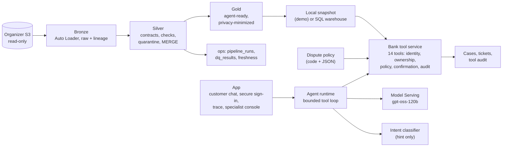

# 07 — Architecture and route to operation

This report describes the system as built, where it uses AI and where it does not, the trade-offs behind those choices, and what it would take to operate it. Details live in the earlier reports and READMEs; each section links to them. Measured figures come from [report 06](06_evaluation.md) and `eval/results/`.

## 1. The system at a glance

| Layer | What it is | Details |
|---|---|---|
| Ingestion and Bronze | Idempotent S3 copy into a Unity Catalog volume, then Auto Loader into Delta tables with per-file lineage | [README](../README.md), `src/bronze/` |
| Silver | Contract-driven typing, the 22 EDA issues fixed, flagged, quarantined or documented, incremental MERGE on a watermark, update-correctness fixture test | [report 04](04_silver_layer.md) |
| Gold | Six agent-ready tables without direct personal data (the document is stored as a hash) | [report 05](05_gold_and_bank_tools.md) |
| Bank tool service | 14 tools behind one pipeline: schema check, session, rate limit, policy gate, handler, audit | [CONTRACT.md](../src/bank_tools/CONTRACT.md) |
| Agent runtime | One LLM in a bounded loop (at most 8 model calls per customer turn) that holds the session token, wraps app events in a nonce tag, and builds the UI cards only from verified tool results | [app README](../app/README.md), `app/agent.py` |
| App | Customer chat (ES/PT), secure sign-in form, per-turn trace, specialist console | [app README](../app/README.md) |
| Deployments | Databricks App `expediente-demo` (workspace login) and a public Hugging Face Space (code public, data and model in a private dataset repo) | [app README](../app/README.md#deploy-as-a-databricks-app) |

## 2. Where AI is used, and where it is not

| Decision | How it is made | Why |
|---|---|---|
| Understand the customer, ask one clarifying question, write the reply in Spanish (tú / usted / vos) or Portuguese | LLM (`gpt-oss-120b`) | Free text in two languages and three regional registers. Measured end to end: 137/140 test scenarios ([report 06](06_evaluation.md)) |
| First reading of the intent | Trained classifier (TF-IDF with keyword features, linear SVM), used as a hint to the model, never as a router | Cheap and local, and it beats the keyword baseline on three held-out sets. A single-message classifier is confidently wrong on follow-ups such as "sí", so it does not decide |
| Who the customer is | Deterministic service: document plus one-time code, HMAC-signed 15-minute session, called by the app's form, never by the model | Identity cannot depend on model text. The model never sees the document, the code, the token or the customer id |
| Which movement is disputed | Deterministic search over the customer's own movements, then the customer picks and confirms | The EDA found the candidate set is tiny (median 1 own movement in 30 days), so this is a lookup plus confirmation, not a learning problem ([report 02](02_eda_workflow_selection.md)) |
| Eligibility, priority, transfer to a person | Synthetic policy in code (`src/policy/`): 90-day window, 7,000 USD threshold, restricted customers, card compromise, tool failure | Auditable and unit-tested; the same code computes the expected outcome of every test scenario |
| Opening a case | Service write that needs the confirmation id from the facts the customer saw, an explicit yes detected by the runtime, an idempotency key and a verified read-back | A model cannot open a case by saying so |
| Amounts and dates as customers write them | Service parser (`src/bank_tools/amounts.py`) and resolution against the service clock | Formats differ by country (thousands separators in COP, "lucas" in ARS, accounts in USD in Mexico) |
| Fraud or credit risk | Not modeled | `is_fraud` is unlearnable in this data (temporal AUC 0.504) and `fraud_score` is built from the label; both are documented negative controls ([report 02](02_eda_workflow_selection.md)) |

## 3. Trade-offs

| Trade-off | Choice | Evidence | What it costs |
|---|---|---|---|
| Autonomy vs human oversight | Automate dispute intake end to end; transfer restricted customers, amounts above the threshold, card compromise, tool failures, explicit requests, and requests still unclear after one question | Automation attempted on 79/79 in-scope test scenarios, 0 missed and 0 unnecessary transfers | About 21% of the test scenarios go to a person by design |
| Accuracy vs latency | `gpt-oss-120b` over faster endpoints | In early smoke tests a faster endpoint skipped steps of the flow; the final agent scores 97.9% on test | Turn latency p50 12.4 s and p95 61.5 s in the exam (several conversations in flight, rate-limited shared endpoint); a few seconds per turn in single-user demo runs, not measured systematically |
| Cost vs context | The full tool catalog on every model call | One loop, no routing layer, every rule visible to the model | 97% of tokens are prompt (median 15,113 per turn). Still about US$ 0.0044 of model per attempted case ([report 06](06_evaluation.md)); trimming tool descriptions or prompt caching would cut it |
| Rules in code vs model judgment | Policy, identity, ownership and matching in the service | The scripted oracle scores 280/280 through the same scorer; 0 unsafe outcomes in 140 test scenarios | A new rule needs code, tests and a release |
| Privacy vs convenience | A secure form for the document and the code instead of typing them in the chat | The model context never holds identifiers | A second interaction surface in the UI |
| Live Gold vs a snapshot for the demo | Local SQLite snapshot of Gold in the demo deployments | No SQL warehouse cold starts (8 s attempt deadline); identical outputs from snapshot and Gold for 4 read tools on 5 customers | Data as of the snapshot; demo cases and tickets live in `/tmp` and end with the instance |
| One agent vs several | One bounded loop | Simpler to evaluate: one transcript per scenario, one scorer | No specialization per task |

## 4. Security and privacy controls

- **Identity.** Document type and number plus a 6-digit one-time code (5-minute TTL, 3 attempts), then an HMAC-signed session with an absolute 15-minute TTL, bound to the conversation. A customer number, e-mail, phone or name never authenticates.
- **Ownership.** Every query carries an ownership predicate; another customer's ids get the same `NOT_FOUND` as unknown ids, and three foreign-resource probes revoke the session.
- **What the model sees.** No customer id, document, code or session token. Merchant names and other data text arrive wrapped as untrusted text. App events carry a per-conversation nonce the customer cannot forge.
- **Writes.** Confirmation id, explicit yes in a later customer turn, idempotency key, verified read-back. Case and ticket ids in a reply must come from a tool result, or the reply is replaced.
- **Audit.** One redacted record per tool call, linked by an HMAC customer key instead of the id; documents, codes and tokens are never logged ([CONTRACT.md, section 7](../src/bank_tools/CONTRACT.md)).
- **Testing.** A security review found 12 issues, all fixed with a test each ([report 05, section 24](05_gold_and_bank_tools.md)); the e2e set includes prompt injection, other customers' data, social engineering, expired sessions and tool failures.

## 5. Access controls

| Surface | Control |
|---|---|
| Organizer data | Read-only S3 credentials stored as a Databricks secret scope, never in code; raw data and credentials never enter the public repository (pre-commit hook) |
| Lakehouse | Unity Catalog schemas `bronze`, `silver`, `gold`, `ops`; read access granted per user |
| Databricks App | Workspace login plus the app's "Can use" permission; the app's service principal has only `CAN_QUERY` on the serving endpoint and no access to tables or warehouses |
| Public Space | Public repo holds code only; data and model sit in a private dataset repo read with a fine-grained token; the model is called by a service principal limited to `CAN_QUERY`; 400 model turns per day, 3 concurrent turns |
| Specialist console | With `APP_CONSOLE_USERS` set, only the listed e-mails (checked against the Databricks Apps proxy header). Both deployments run with demo controls on, so today anyone who can open the app sees it, on synthetic data and with customer ids masked |

## 6. Capacity and limits

| What | Measured or set | Source |
|---|---|---|
| Tokens per customer turn | Median 15,113, p95 21,243 | Agent exam, test split |
| Model calls per turn | Median 3, p95 4 (bounded at 8) | Agent exam |
| Turn latency | p50 12.4 s, p95 61.5 s, with 221 rate-limit waits | Agent exam (shared pay-per-token endpoint) |
| Concurrent model turns | 8 (Databricks App), 3 (Space); a turn waiting more than 15 s gets HTTP 503 | `app.yaml`, Space Dockerfile |
| Live conversations | One process, state in memory, up to 1,000 conversations; 30 new ones per client every 10 minutes; 40 messages each; ends after 60 idle minutes | [app README](../app/README.md) |
| Data volume | 7,874,194 rows in 12 tables, refreshed as a daily batch (`digital_events` not loaded) | [report 02](02_eda_workflow_selection.md), [report 04](04_silver_layer.md) |

The binding constraints are the pay-per-token endpoint's rate limits and the prompt size. The path to more capacity is provisioned throughput for the model (listed at 71.429 DBU per hour for `gpt-oss-120b` in the [Databricks pricing table](https://learn.microsoft.com/en-us/azure/databricks/resources/pricing)), a smaller prompt, and a shared state store so the app can run more than one replica.

## 7. Monitoring

**What exists today:**

- Pipeline: `ops.pipeline_runs`, `ops.dq_results` and `ops.freshness`, plus a quarantine table per Silver table ([report 04, section 9](04_silver_layer.md)).
- Agent: the per-turn trace in the app (tools, policy decisions, durations, tokens), one audit record per tool call (JSONL, with a `workspace.ops.tool_audit` sink), and the agent exam as a repeatable measurement with fingerprints of the agent version.

**What a production deployment would watch** (none of this is wired into dashboards or alerts yet):

| Signal | From | Why |
|---|---|---|
| Freshness lag, hard-check failures, quarantine growth | `ops.freshness`, `ops.dq_results`, quarantine tables | The agent answers from this data |
| Tool error rates by code, `security_events` | Tool audit | Outages, fault patterns, probing |
| Outcome mix: cases opened, transfers by reason, containment, replaced replies, fallbacks | Tool audit and runtime trace | Drift in behavior after a model or prompt change |
| Latency p50 and p95, model retries and 429s, tokens and DBU per day | Runtime trace, serving usage | Cost and service level |
| Success by language and customer group | Agent exam per release | Fairness regressions |

A release would pass the scorer's oracle check (280/280) and the agent exam on the dev split before the test split is touched again.

## 8. Data retention

| Data | Retention |
|---|---|
| Local audit JSONL | 30 days, purged by `python -m src.bank_tools.retention` |
| `ops.tool_audit` | 90 days, purged manually (no scheduled job yet) |
| One-time-code challenges | Deleted at expiry |
| Case drafts | Session expiry plus 24 hours |
| Idempotency records | 24 hours |
| Conversations in the app | End after 60 idle minutes; the tool-call index is dropped |
| Demo cases, tickets and audit in the deployments | In `/tmp`: they end when the instance restarts |

All data is synthetic. A bank would apply its own record-retention and legal-hold rules ([CONTRACT.md, section 7](../src/bank_tools/CONTRACT.md)).

## 9. What is left before a real deployment

| Area | Remaining work |
|---|---|
| Identity and keys | The bank's identity provider and real one-time-code delivery instead of the test outbox; managed keys with rotation; a keyed hash or tokenization instead of the unkeyed `document_hash` |
| State and scale | A shared store for sessions, conversations and rate limits so the app can run several replicas; provisioned throughput; a load test |
| Integrations | A case-management system and the agents' desk instead of mock cases and tickets; status updates and SLA tracking from `first_response_due_at` |
| Data operations | Deploy the Bronze, Silver and Gold jobs with a chained daily schedule (they are defined in `databricks.yml` and have only been run manually); scheduled retention jobs; a low-latency serving store for Gold instead of the snapshot |
| Model operations | Dashboards and alerts on the signals above; the agent exam as a release gate; review of a sample of real conversations |
| Known failure modes | Relative weekdays ("el lunes pasado") should search the period that covers both everyday readings; amounts given as text should never become numbers ([report 06](06_evaluation.md)) |
| Evaluation | More hand-written messages from more authors (today 61 from one); real customer transcripts (the dataset's are templates); outcomes by country and customer segment |
| Compliance | A real, country-specific dispute policy and legal review (the current policy is synthetic); native-speaker review of the Portuguese; an accessibility audit |
